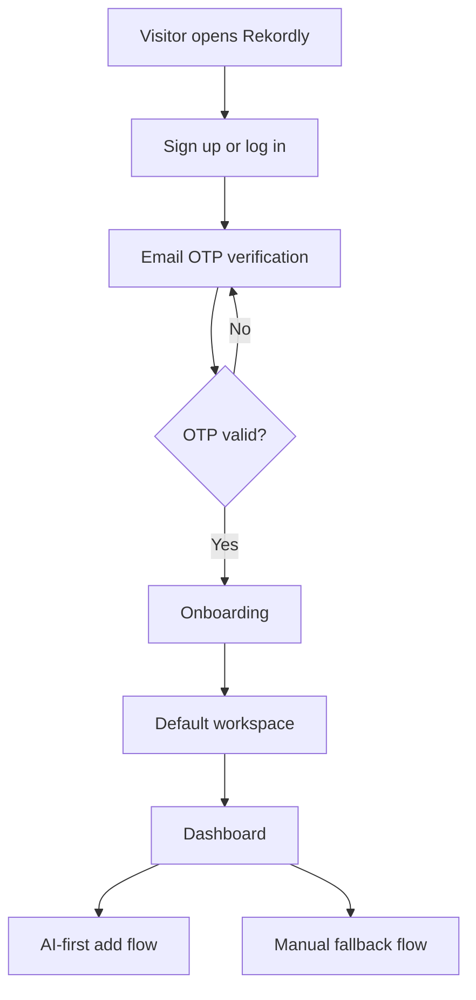
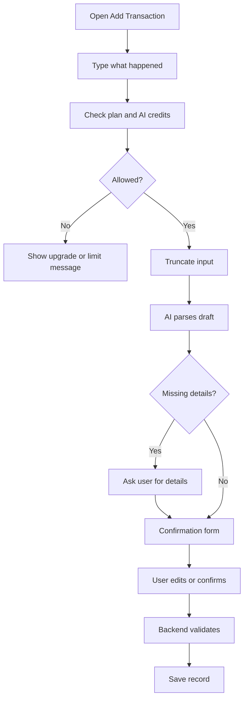
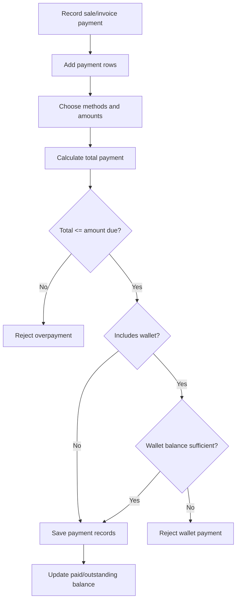
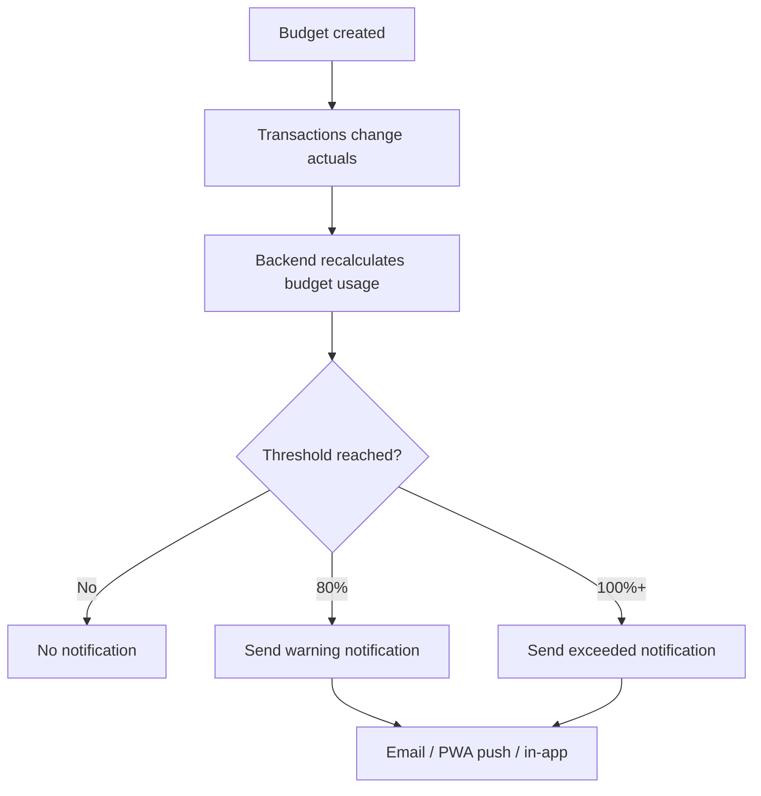
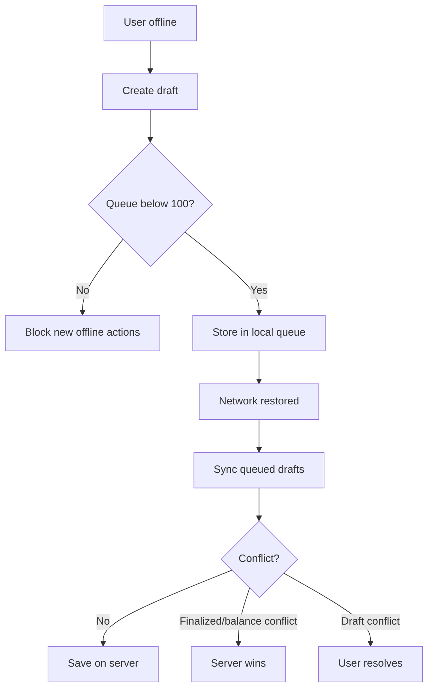

# 04 - Rekordly V2 User Flows

## Purpose

This document turns the approved product vision and MVP feature map into practical user journeys for Rekordly v2.

It describes how users should move through the product, what decisions they make, and where the system must validate financial truth. It does not define API endpoints, database schemas, or implementation-level service boundaries.

The flows are strictly MVP-bounded. Storefront, complex inventory, complex production, quotations, WhatsApp Business API integration, and complex amortization remain Phase 2.

## MVP Flow Principles

- AI-first entry: "Type what happened" is the primary create flow.
- Manual forms are fallback and confirmation surfaces.
- Backend owns financial truth.
- Server-side plan enforcement is required.
- Offline mode should be useful but bounded.
- Personal, business, mixed, and transfer classification must appear in finance flows.
- User confirmation is required before AI-created drafts become saved financial records.
- Dashboard and report views should rely on backend aggregates, not client-side scans of raw records.

## UI/UX Flow Principles

- V2 should preserve v1's general visual language, layout feel, and familiarity so existing users are not disoriented.
- The frontend architecture should be rebuilt under the hood with shared reusable components.
- Add flows should use standardized global drawers.
- Forms should use reusable modals, consistent validation states, and predictable submit/error behavior.
- Client state should be centralized through clear stores rather than scattered per-page state.
- The user experience should feel familiar, but smoother, faster, and more predictable than v1.

## Primary User Journey

1. Visitor lands on the public site.
2. Visitor signs up or logs in from the Next.js frontend on `rekordly.com`.
3. User verifies with email OTP.
4. User completes onboarding.
5. System creates or assigns one default workspace.
6. User lands on the dashboard.
7. User starts by adding activity through AI-assisted entry or a manual fallback form.

Auth assumptions:

- SMS is excluded across the app due to cost.
- MVP OTP uses email.
- Auth should use a provider abstraction so future channels, including WhatsApp OTP in Phase 2, can be added without rewriting the auth flow.
- Next.js owns login and signup UI.
- The Go API validates protected actions on `api.rekordly.com`.

## AI-Assisted Entry Flow

AI-assisted entry is the primary way users create financial records.

1. User opens the global Add Transaction drawer.
2. User types what happened in plain language.
3. System checks plan limits and AI credit availability.
4. Backend truncates input before LLM processing.
5. AI parses the text into a draft record.
6. System asks for missing required details if needed.
7. User reviews and edits the confirmation form.
8. User confirms.
9. Backend validates the final record.
10. Record is saved and audit metadata is retained.

Examples:

- "Bought fuel 5k for delivery."
- "Sold 2 bags of rice for 20k."
- "Customer A deposited 50k for next order."
- "Paid back 10k from my loan."

MVP AI entry is via the web app only. Architecture must allow a future WhatsApp channel to submit text to the same AI parsing backend.

Failure states:

- AI limit reached: show clear limit or upgrade message.
- AI confidence is low: require manual review.
- Required fields are missing: block save until completed.
- Validation fails: keep draft open with actionable errors.

## Manual Finance Entry Flow

Manual entry is the fallback and confirmation path for users who prefer structured forms or need to correct AI drafts.

1. User opens Add Transaction.
2. User selects income, expense, sale, or purchase.
3. User enters amount, date, currency, category, counterparty, and notes.
4. User selects transaction classification: personal, business, mixed, or transfer.
5. If mixed, user enters allocation before submission.
6. User confirms payment status and payment method.
7. Backend validates the record.
8. Record is saved.

Mixed transaction rule:

- Mixed records must not save without allocation.
- Allocation should be visible on reports and budgets.

## Invoice Flow

1. User opens Create Invoice.
2. User selects or creates a customer.
3. User adds line items.
4. User adds tax, discount, due date, and notes.
5. User previews the invoice.
6. User saves, sends, or downloads the invoice.
7. User records payment when customer pays.
8. Backend updates invoice payment status from payment records.

Rules:

- PDF generation is backend-owned.
- Invoice summaries use backend aggregates.
- Invoices support full, partial, split, and wallet payments.

## Split Payment Flow

Split payment applies to sales and invoices.

1. User opens payment section for a sale or invoice.
2. User adds one or more payment rows.
3. Each row has method and amount.
4. Supported MVP methods: wallet, cash, transfer, POS.
5. System totals payment rows before submission.
6. Backend rejects payment if total exceeds amount due.
7. If wallet is used, backend validates available wallet balance.
8. Backend saves valid payment records and recalculates outstanding balance.

## Customer Wallet / Advance Deposit Flow

Customer wallets support advance payments and store credit.

1. Customer pays without an immediate purchase.
2. User records the payment as a deposit.
3. Backend validates customer and amount.
4. Deposit increases customer wallet balance.
5. Deposit is treated as a trust/liability balance, not revenue.
6. Future sale or invoice can use wallet as a payment method.
7. Backend rejects wallet payment above available balance.

Rules:

- Negative wallets are not allowed.
- Wallet balances are server-side financial truth.
- Wallet deposits are not revenue until applied to a sale or invoice according to the final accounting rules.

## Simple Loan / Debt Flow

Simple loans track money borrowed and money lent.

1. User records a loan/debt.
2. User chooses direction: borrowed or lent.
3. User enters principal, counterparty, start date, due date, notes, and currency.
4. System creates the simple loan/debt record.
5. Repayments are recorded as normal linked transactions using a `loan_id` reference.
6. Backend validates repayment link and amount.
7. Loan balance is reduced by validated repayments.

MVP exclusions:

- No amortization.
- No compound interest.
- No interest schedules.
- Interest is recorded manually as normal income or expense.

## Budgeting Flow With Notifications

1. User creates a personal or business budget.
2. User chooses weekly, monthly, or yearly timeframe.
3. User sets category expense limits and/or income goals.
4. Backend aggregate calculations compare actual activity to budget targets.
5. Dashboard displays budget status.
6. System triggers alerts when warning or exceeded thresholds are reached.

Budget statuses:

- On track
- Warning
- Exceeded
- Under target
- Met

Notification rules:

- Warning threshold example: 80%.
- Exceeded threshold: 100%.
- MVP notification channels: email, PWA push notification, and in-app notification.
- Notifications must be infrequent and unobtrusive to avoid spam.
- SMS is excluded across the app due to cost.
- Notification architecture must use a generic notification service so WhatsApp can be added as a Phase 2 channel without rewriting alert logic.

## PWA / Offline Flow

1. User loses network connection.
2. App switches to offline-aware mode.
3. User creates a draft record.
4. Draft is added to local offline queue.
5. Queue allows up to 100 pending actions.
6. If queue is full, app blocks new offline records until sync completes.
7. User comes back online.
8. App syncs queued drafts.
9. Backend validates each action.
10. Conflicts are handled according to server-wins rules.

Server-wins records:

- Finalized financial records
- Balances
- Wallet balances
- Loan balances
- Finalized invoices

Draft conflicts require user resolution.

## Subscription / Plan Limit Flow

1. User attempts a gated action.
2. Frontend may show plan state or locked UI.
3. Backend checks plan limits before write operations or AI calls.
4. If allowed, action continues.
5. If blocked, backend returns a clear limit-reached or upgrade-required response.
6. Frontend shows upgrade path or plan-limit message.

Plan-gated areas include:

- Transactions
- Invoices
- Loan records
- Wallet deposits
- AI credits
- Exports
- Offline sync depth
- Reports and plan-only features

## Export / Data Ownership Flow

1. User opens export for records, reports, or invoices.
2. User selects CSV or PDF.
3. Backend checks plan/export limits.
4. Backend generates the export.
5. User downloads the file.

Principle:

- Users own their data.
- Export should be reliable and understandable.
- CSV should support portability.
- PDF should support sharing and business documentation.

## Phase 2 Exclusions

The following are not MVP user flows:

- WhatsApp Business API integration
- Storefront
- Complex inventory
- Complex production
- Quotations
- Complex amortization and interest scheduling

They may be referenced as future-compatible architecture needs, but this document must not design their full workflows.

## Review Criteria

- Confirm no Phase 2 workflows are designed as MVP.
- Confirm SMS is excluded due to cost.
- Confirm notification service is generic and WhatsApp-ready for Phase 2.
- Confirm UI guidance preserves v1 feel while requiring rebuilt reusable frontend flows.
- Confirm AI entry remains the primary creation path.
- Confirm manual forms remain fallback and confirmation tools.
- Confirm wallet validation is represented.
- Confirm split payment validation is represented.
- Confirm simple loan validation is represented.
- Confirm offline queue cap and server-wins rules are represented.
- Confirm plan-limit validation is backend-owned.

## Assumptions

- MVP has one workspace per user.
- Personal and business records live in the same workspace.
- Transaction type tags separate personal, business, mixed, and transfer activity.
- MVP uses one default workspace currency but stores currency codes.
- MVP auth uses email OTP, not SMS.
- MVP notifications use email, PWA push, and in-app notifications only.
- WhatsApp is Phase 2, but auth, notification, and AI flows should remain channel-ready.
